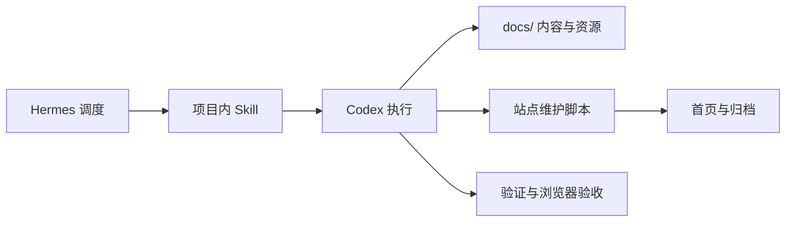

# Hermes/Codex 生产框架架构

这个项目不是普通的静态站点仓库，而是“第二号”的内容生产系统。生产框架的目标是让 AI 日报和深度调研报告可以稳定、可复查、可验证地生成，并且在视觉样式上始终符合项目要求。

文档中的 Hermes、Codex、skill、Builder、Pagefind 等是系统内已有专名；除此之外，架构说明尽量使用中文描述。

## 核心边界

Hermes 负责调度和发号施令。它决定什么时候需要生产日报或调研报告，选择项目内的 skill，并把任务交给 Codex。

Codex 负责仓库内执行。它修改文件、下载或整理媒体资源、运行生成器、执行校验、做浏览器验收、重建搜索索引，并报告结果。

代码库负责保存契约。全局 Hermes skill 可以引用这里，但结构、样式、验证、交接方式的权威来源必须在仓库内：`docs/agents/`、`scripts/` 和 `.github/`。



## 生产轨道

### AI 日报

输入是 Builder 动态、社交媒体、播客、GitHub 项目和必要的背景资料。

结构契约是 `docs/agents/contracts/daily-digest.schema.json`。

输出是 `docs/daily/ai-news-YYYY-MM-DD.html` 和 `docs/daily/assets/YYYY-MM-DD/`。

页面必须使用共享 header、`docs/styles.css`、bento 区块、Builder 双列/瀑布流卡片，并为本地图片写入 `width` 和 `height`。

### 深度调研报告

输入是主题 brief、资料来源、架构观察、可选图表或截图。

结构契约是 `docs/agents/contracts/research-report.schema.json`。

输出是 `docs/research/<slug>.html`，必要时附带本地图表、截图或可交互图。

页面必须使用共享 bento 设计系统，保留清晰来源归因，并对架构图、嵌入图和移动端布局做浏览器验收。

### 站点维护

输入是已经存在的内容文件。

执行入口是 `scripts/site_harness.py`。

输出是 `docs/index.html`、`docs/daily/archive.html`、`docs/research/archive.html` 和结构校验结果。

## 标准执行流程

1. Hermes 从 `docs/agents/skills/` 选择项目内 skill。
2. Codex 获取或接收源数据，生成页面和资源。
3. Codex 运行 `npm run site:update`，刷新首页与归档。
4. Codex 运行 `npm run site:validate` 和 `bash .github/style-check.sh .`。
5. 如果公开内容发生变化，Codex 运行 `npm run build:search`。
6. 如果涉及布局、媒体、搜索或图表，Codex 在浏览器里检查桌面端和移动端。
7. Codex 汇报变更文件、验证命令、残留风险。

## 稳定命令入口

不要直接调用裸 `python3`。Python 入口应通过 `scripts/python.sh` 或下面的 npm scripts 执行，这样可以避开本机不稳定的 Python shim，并优先选择 Python 3.11。

```bash
npm run site:update
npm run site:validate
npm run build:search
bash .github/style-check.sh .
```

## 校验职责

`scripts/site_harness.py validate` 检查每次发布都应该成立的结构事实：HTML 是否完整、是否使用共享样式、首页与归档是否同步、本地链接是否存在、设计 token 是否存在、日报 Builder 图像是否带有尺寸信息、图片组件兼容层是否仍在共享脚本里、生产 contract 是否仍在仓库内。

`.github/style-check.sh` 是部署前门禁。它可以保留一些面向历史页面的检查，但结构判断应逐步下沉到 `scripts/site_harness.py`。

浏览器验收仍然必要，因为静态检查无法证明视觉行为，例如瀑布流对齐、移动端溢出、搜索弹窗、架构图嵌入效果。

## 图片组件与旧日报兼容层

新增日报应直接写出规范结构：图片放在 `.vitem-gallery` 中，2 张图使用 `cols-2`，3 张及以上使用 `cols-3`，本地图片保留 `width` 和 `height` 属性。

旧日报不要求逐篇重写。`docs/site.js` 在页面加载时执行 `upgradeLegacyDailyGalleries()`，扫描 `.vitem` 和 `.card` 下直接散落的本地图片，把它们移动进自动生成的 `.vitem-gallery`。这样早期日报也能复用同一套多图等高、点击放大、键盘可访问能力。

兼容层只处理 `src` 以 `assets/` 开头的本地图片，避免误伤外链、徽章、图标和搜索组件。未来如果批量迁移旧日报 HTML，可以保留这个兼容层作为防回归兜底。

## 演进方向

生产框架后续应该把更多逻辑从纯文本 skill 移到可执行契约里：

- 用结构化数据渲染日报和调研报告，而不是直接手写完整 HTML。
- Daily Source 放在 `docs/daily/data/YYYY-MM-DD.json`；构建期由 `scripts/render_daily.py` + `scripts/templates/components/` 渲染 section，再 merge 进 `docs/daily/ai-news-YYYY-MM-DD.html`。
- 全页 ingest：`scripts/ingest_daily_html.py --date DATE --from-html PATH [--render]` 从 HTML 抽取 hero / 今日要点 / 播客 / RSS / builders / 今日思考 / 参考来源；保留已有 `github` section。
- GitHub Trending 由 `scripts/gen_gh_cards.py` 写入 Daily Source JSON（`layout: simple|card`），不再 patch HTML；可选 `--render`。
- Builder 区由 `scripts/gen_tweet_cards.py`（`layout: tweet`）或 ingest（`layout: vitem`）写入 JSON。
- RSS 由 `scripts/gen_rss_cards.py` 写入 `kind: news` section；可选 `--render`。
- npm：`site:ingest-daily`、`site:ingest-tweets`、`site:ingest-rss`、`site:render-daily`。
- `site_harness.py` 索引 Daily 时优先读取 Daily Source 的 `title` / `summary`。
- 把设计 token 和组件继续集中在 `docs/styles.css`。
- 把外部信息抓取做成可替换步骤，因为 X/Twitter、YouTube、GitHub 的表面经常变化。
- 所有项目特定的 agent 行为先落在本仓库，再同步到全局 Hermes skill。
